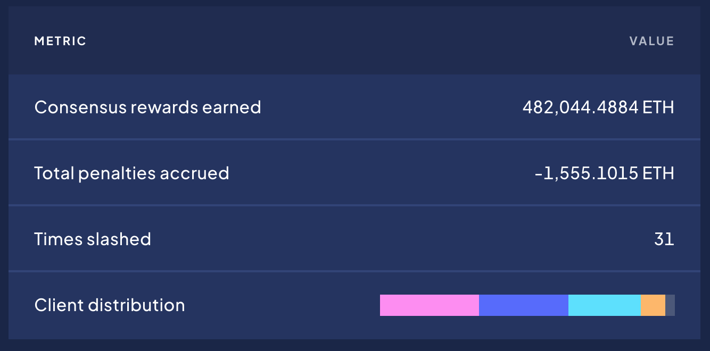

# Performance Analysis

The Performance Analysis section is essential for providing a data-driven foundation to understand wstETH's market dynamics, user adoption, competitive edge, and economic viability. It enables investors, users, and the platform itself to make informed decisions based on quantitative data, thereby reducing risk and identifying opportunities for strategic positioning and growth in the evolving DeFi ecosystem.

## Total value locked (TVL)

TVL in the case of LSTs is best measured in the number of ETH staked because it shows the project trajectory without the influence of ETH price changes. The number of staked ETH has seen a steady increase over time and approaches 10m ($23b) as of Feb 2024 . This represents around 8% of all ETH in circulation and a 72% share of the LST market/

<figure><figcaption>
source: <a href="https://defillama.com/protocol/lido?denomination=ETH">defillama</a>
</figcaption></figure>

## Dex Transaction Volume

* **Average Daily Trading Volume:** around $70m ADV across Curve, Balancer, Maverick and UNIv3 [\[lido dune\]](https://dune.com/lido/wsteth-price-impact)
* **Depth of Order Books:** Average TVL on ETH main net over the last 90 days was $362m.&#x20;
* **Price Impact weighted by trade size:**  With a few exceptions trading stETH rarely has significant price impact. The second chart shows that the trades with a larger impact were made in thin liquidity pools since much larger trades were able to be made with significantly less impact around the same time.&#x20;

## On-chain activity

The numbr of transactions averages 13.56k and has shown a steady increase over time.

<figure><figcaption>
source: <a href="https://app.intotheblock.com/coin/STETH/deep-dive?group=network&#x26;chart=transactions">intotheblock</a>
</figcaption></figure>

Transactions of all sizes have increased in volume over time, including significant increases in large transactions over $100k indicating greater adoption by sophisticated users.

<figure><figcaption>
source: <a href="https://app.intotheblock.com/coin/STETH/deep-dive?group=network&#x26;chart=transactions">intotheblock</a>
</figcaption></figure>

According to data from [DappRadar](https://dappradar.com/dapp/lido), in the **last 24 hours**, 3100 Unique Active Wallets (UAW) had interacted with Lido on Ethereum and made 386 transactions with the protocol's smart contracts.

<figure><figcaption></figcaption></figure>

Daily, Weekly, and monthly users have both bees steady over the last year until the start of February which has seen a large increase in users.&#x20;

<figure><figcaption>
source: tokenterminal
</figcaption></figure>

## Protocol Integrations

<figure><figcaption>
source: <a href="https://etherscan.io/token/tokenholderchart/0xae7ab96520de3a18e5e111b5eaab095312d7fe84">Etherscan</a>
</figcaption></figure>

<figure><figcaption></figcaption></figure>

### **wstETH holders**

<figure><figcaption>
Source: <a href="https://etherscan.io/token/0x7f39c581f595b53c5cb19bd0b3f8da6c935e2ca0#balances">Etherscan </a>
</figcaption></figure>

<figure><figcaption></figcaption></figure>

## **Competitor Analysis**

<figure><figcaption>
source:<a href="https://defillama.com/lsd"> defillama</a>
</figcaption></figure>

stETH market share currenty (Feb 2024) sits at 71.68% and has seen a steady decline from its 93.7% highs around July 2022 as the number of competitors increases and the Ethereum community pushes for a more diversified approach to liquid staking. Whlie its share has decreased, the number of staked ETH has continued to rise as highlighted in the TVL analysis.&#x20;

## Staking Yield

<figure><figcaption>
Source: <a href="https://dune.com/queries/1288160/2264095">dune</a>
</figcaption></figure>

Execution layer rewards depend on the performance of the validator at the application layer (MEV solution, traffic volume) and make up around 25% of the overall staking yield on average.  The current staking yield for stETH is 4.28%.\
\
stETH ranks highly amongst its competitors for yield, currently second amongst the top 10 by marketcap according to defillama

<figure><figcaption>
source: <a href="https://defillama.com/lsd">defillama</a>
</figcaption></figure>

## Node Effiectiveness

The Rated Validator Effectiveness Rating (RAVER) by [rated.network](https://www.rated.network/?network=mainnet\&view=pool\&timeWindow=all\&page=1\&poolType=all) assesses a validator's performance based on their deterministic duties, focusing on aspects under their control, such as attestation inclusion, to ensure they're consistently online. It minimizes the influence of random factors like execution layer rewards. Utilizing the validator index as its core unit, RAVER calculates a completion rate percentage by tallying the fulfilled duties over specified periods (e.g., 10 epochs, a day, a year), offering a direct measure of a validator's reliability. This score effectively reflects an operator's ability to manage efficient infrastructure. RAVER excels in aggregating individual validator keys into larger clusters or "operators," maintaining its effectiveness and clarity in signaling performance across different scales.

<figure><figcaption>
source: <a href="https://www.rated.network/?network=mainnet&#x26;view=pool&#x26;timeWindow=all&#x26;page=1&#x26;poolType=all">rated.network</a>
</figcaption></figure>

Lido NOs rank as moderatey effective collectively. The difference between a moderate rank and good rank is under 1%.\
\
During October 2023, Lido saw their largest slashing event, which occured when 20 validators had connectivity issues and non-optimal fallback procedures resulting in validators double voting and being slashed. Lido were quick to respond and notified the node operator who shut down the validators while they diagnosed the root cause. In total 28 ETH were lost in the incident.  The full post mortem is available on the [Lido blog](https://blog.lido.fi/post-mortem-launchnodes-slashing-incident/).

Lido has been slashed a total of 31 times to date (Feb 2024) resulting in 1555 ETH in penalties.&#x20;

<figure><figcaption>
source: <a href="https://www.rated.network/o/Lido?network=mainnet&#x26;timeWindow=all&#x26;viewBy=aggregate&#x26;idType=pool">rated.network</a>
</figcaption></figure>

<figure><figcaption>
Source: <a href="https://www.rated.network/?network=mainnet&#x26;view=pool&#x26;timeWindow=all&#x26;page=1">Rated.network</a>
</figcaption></figure>

## Liquidity Sustainability

If liquidity subsidisation is used, it should be sustainable and of sufficient size to absorb changes in supply and demand short term. Lido incentivizing stETH liquidity with several strategies  managed by the [reWARDS committee](https://research.lido.fi/t/proposal-to-form-rewards-committee/1447), formed in December '21 and managed by a 4-of-6 multisig whose members are disclosed [here](https://research.lido.fi/t/proposal-to-form-rewards-committee/1447/13). Lido later expanded cross-chain rewards to Optimism and Arbitrum in September '22. In May '23, The LDO reWARDS program was deprecated by a governance decision in favor of [incentives paid in stETH](https://research.lido.fi/t/easy-track-setup-for-rewards-in-steth/4620) with a quarterly budget of 2,100 stETH. This updated reWARDS program was authorized through EOY 2023. In August '23, the reWARDS committee was rebooted under the name [Liquidity Observation Lab](https://research.lido.fi/t/liquidity-observation-lab-lol-liquidity-strategy-and-application-to-curve-steth-eth-pool/5335) (LOL) with the purpose of analysing liquidity and providing incentives to maintain DEX liquidity large enough to absorb supply shocks and to ensure that other incentives are directed only short term, to achieve predefined goals and for the most high impact projects. The budget remains at 2100 stETH ($5.25m as of Feb 24) per quarter which represents around 25% of total revenue.

<figure><figcaption>
source: token terminal
</figcaption></figure>
