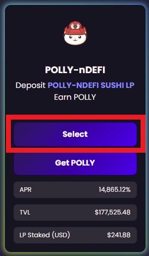
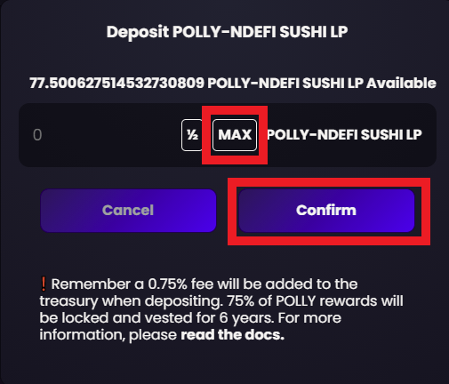

# Staking on Polly Finance


The following Step-by-Step guide assumes that you already provided liquidity to a[ Sushi pool​](https://docs.bao.finance/guides/polygon-matic-guides/adding-liquidity-to-sushiswap).


1\) Go to [PollyFinance.com](https://pollyfinance.com/farms?ref=null) and click on the “Farms” tab near the top and connect your wallet.

2\) Click the **Menu** and select the farm you want to provide (stake) liquidity.

**3) Approve** the Sushi Liquidity pool token to the farming contract then confirm the transaction in your wallet.

4\) Click the **+** button to stake

**5) Select the amount** of liquidity pool tokens to stake, then **confirm** the transaction in your wallet.


You successfully staked liquidity in a Polly pool!

