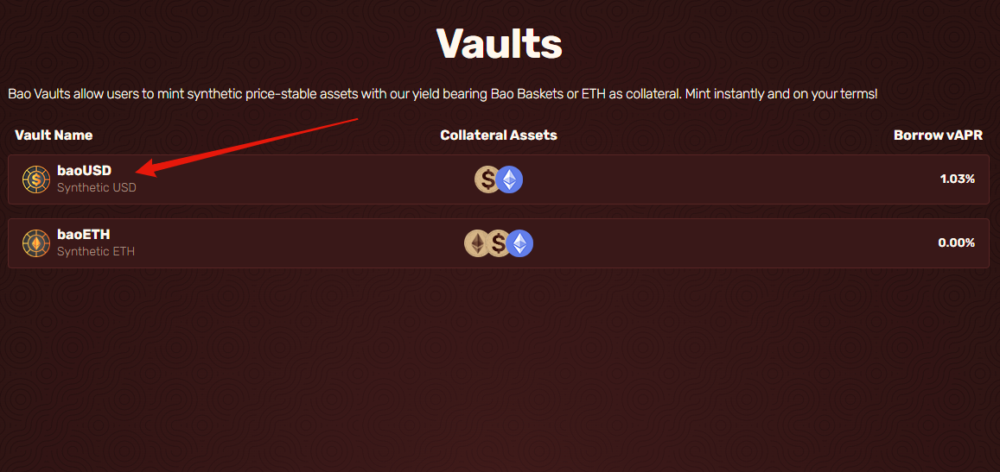
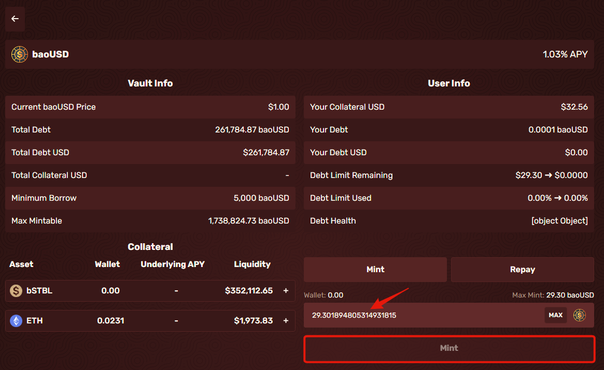

# Minting/Borrowing


Collateral will be flagged for liquidation once your health factor drops to 1


* Select the Synthetic you want to mint. I want to mint some baoUSD with my supplied collateral.

<figure><figcaption></figcaption></figure>

* Put in the desired amount you wish to mint out of the amount that's available to you from your supplied collateral, then click Mint. This will bring up a transaction and click confirm in your wallet.

* When the transaction is complete, your debt limit will have decreased, and the assets you minted will now be in your wallet. Your health factor will also have been recalculated.

**Make sure to keep an eye on your health factor so you are not liquidated!**
