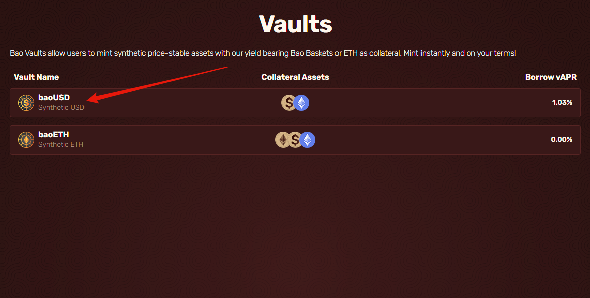

# Repaying

* Select a token you have minted and wish to repay.

* Click on the repay tab to switch to it once you are on the repay tab, enter the amount you wish to repay out of your minted amount. Then click on approve baoUSD. This will bring up a transaction on your wallet; click confirm, then do the same for Repay at the bottom of the menu.

* After the transaction goes through, your borrowing limit and health factor will change to reflect the debt you paid back.
