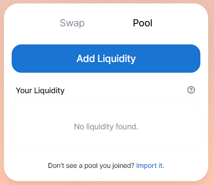
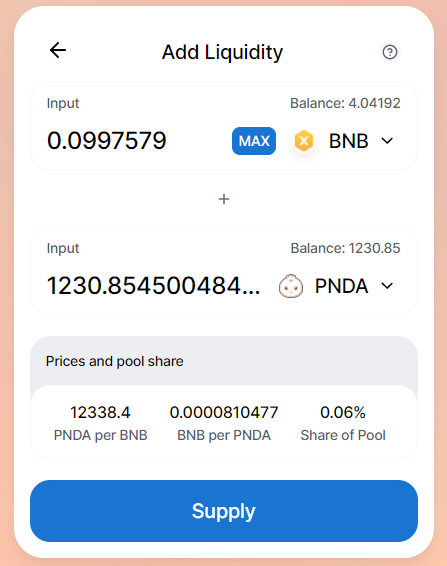
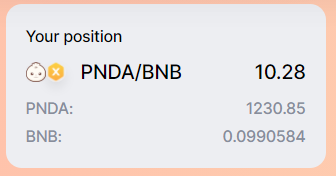

# Add liquidity to PandaSwap

* Browse to [https://pandaswap.xyz/#/pool](https://pandaswap.xyz/#/pool)
* Ensure your wallet is on the BSC chain then connect your wallet
* Click **Add Liquidity**

* choose the tokens you want to add liquidity for from the dropdown box
  * If a token isn't available in the dropdown list, you can find the **BSC Token Address** from [https://docs.bao.finance/contracts-and-key-info](https://docs.bao.finance/franchises/panda/pandaswap-contract-key)
  * Paste the address in the search box.

* Select the amount of liquidity you wish to add
* If required, approve the spending of each token by clicking the **Approve \[token name]** button and confirming the transaction
* Click **Supply** and confirm the transaction within your wallet

You should then be able to see the confirmation after waiting a few seconds and your current position in the pool.

You have now your Panda liquidity pool token in your wallet and ready to stake !
