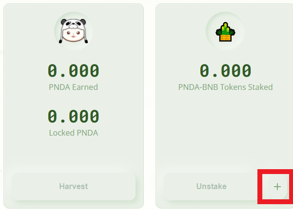
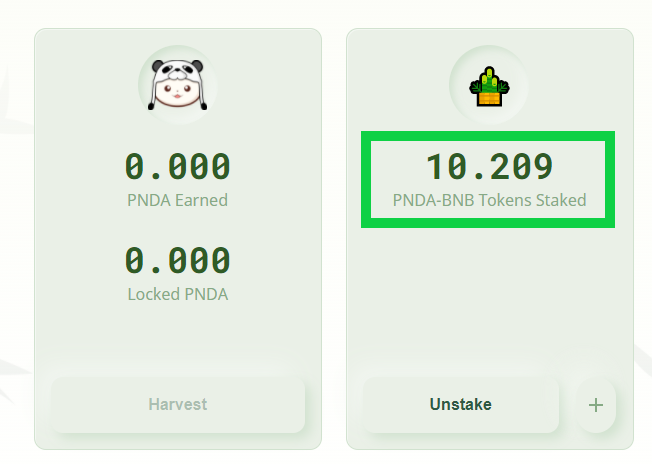

# Stake Liquidity Pool Tokens on Pandaswap


The following Step-by-Step guide assume that you already provided liquidity to a [PandaSwap pool](https://docs.bao.finance/guides/binance-smart-chain/add-liquidity-to-pandaswap) or have already liquidity pool tokens from a [supported PancakeSwap pool](https://docs.bao.finance/franchises/panda/pandaswap-contract-key#pancakeswap-lp)


Browse to [**farms.pandaswap.xyz**](https://farms.pandaswap.xyz/) and make sure your Metamask wallet is on the BSC network, then **Connect your wallet.**

.png>)

Click the **Menu** and select the farm you want to provide (stake) liquidity.

**Approve** the Panda Liquidity pool token to the farming contract then confirm the transaction in your wallet.

Click the **+** button to stake

**Select the amount** of liquidity pool tokens to stake, then **confirm** the transaction

You successfully staked liquidity in a Panda pool !

