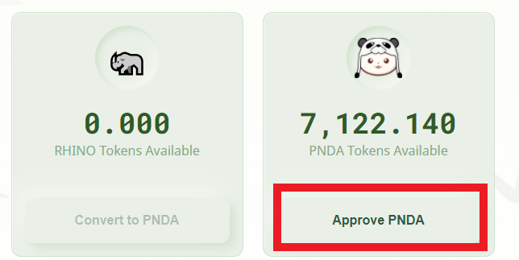

# Staking PNDA

When staking PNDA, you have 2 options. **** [**BAMBOO**](https://docs.bao.finance/franchises/panda/items-and-creatures/items#a1ba), our xSUSHI style staking product that uses some of the exchange fees to buy back PNDA from the market and distribute to BAMBOO holders. Over time each BAMBOO will be worth more and more PNDA as fees are distributed. \
\
[**RHINO** ](https://docs.bao.finance/franchises/panda/items-and-creatures/creatures#8766)is our experimental, high reward staking product that has quite severe penalties for unstaking and transferring to incentivise PNDA to stay staked. In return RHINO holders get a larger share of rewards.

## BAMBOO

### Staking

Go to [**https://farms.pandaswap.xyz**](https://farms.pandaswap.xyz/?ref=null)**,** click on the BambooBar section and unlock your wallet.&#x20;

Once you have connected your wallet you should see your PNDA balance. Click **Approve PNDA** to allow your PNDA to be used by the site then confirm the transaction in your wallet.

.png>)

&#x20;Click **convert to BAMBOO**

.png>)

Choose how many PNDA you would like to stake and click **Confirm**, then confirm the transaction in your wallet.

.png>)

### Liquidity pool staking

You are wondering now what you can do with those BAMBOO tokens in your wallet ? You can [add liquidity](https://docs.bao.finance/guides/binance-smart-chain/add-liquidity-to-pandaswap) to the BAMBOO / BNB pool in PandaSwap and [stake the liquidity pool tokens](https://docs.bao.finance/guides/binance-smart-chain/stake-panda-lp-on-pandaswap) in Panda's farm to earn more PNDA !

### Exchanging BAMBOO to PNDA

In order to exchange your BAMBOO back to PNDA, you need to repeat the same steps to exchange PNDA to BAMBOO , but in the other way.

## RHINO

To stake your PNDA token for RHINO, head to the Rhino section of [**https://farms.pandaswap.xyz**](https://farms.pandaswap.xyz/?ref=null) **** and connect your wallet.

Click **Approve PNDA** to approve the PNDA token for the staking contract and confirm the transaction in your wallet.

Click **Convert to RHINO**&#x20;

.png>)

Select the amount of PNDA tokens you wish to deposit and click **Confirm**. Finally, confirm the transaction in your wallet.

Wait a few seconds and the Rhino tokens should be in your wallet. Don't be surprise, you will pay a 12% trade fee as outlined in the [RHINO specifications](https://docs.bao.finance/franchises/panda/items-and-creatures/creatures#8766).

You will now need to click on the Withdraw RHINO button and confirm the transaction within your wallet

You have now RHINO in your wallet !

### Liquidity pool staking

You are wondering now what you can do with those RHINO tokens in your wallet ? You can [add liquidity](https://docs.bao.finance/guides/binance-smart-chain/add-liquidity-to-pandaswap) to the RHINO / BNB pool in PandaSwap and [stake the liquidity pool tokens](https://docs.bao.finance/guides/binance-smart-chain/stake-panda-lp-on-pandaswap) in Panda's farm to earn more PNDA !

### Exchanging RHINO to PNDA

In order to exchange your RHINO back to PNDA, you need to repeat the same steps to exchange PNDA to RHINO, but in the other way.
