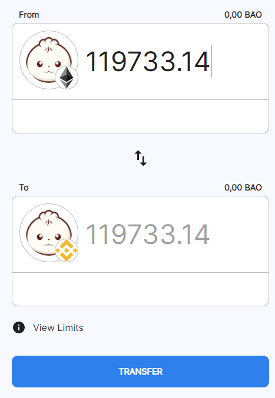

# Bridging Assets to BSC


To use the BSC network with Metamask you will need to add [**BSC to Metamask**](add-bsc-to-metamask.md) **** first.


## ETH<->BSC

### Multichain&#x20;


Only use Multichain for BAO token.


At the time of writing, multichain is the only bridge that will let you move BAO from ETH to BSC and back.&#x20;

* Browse to [**https://multichain.xyz/**](https://multichain.xyz/)****
* Click on the **token logo** in the from section and choose, or search for the token you want to bridge. In the example we will bridge BAO.
* Be sure to bridge BAO **from ETH main net to BSC network**. Don't use BAO on xDai network as this will lead to a wrong token being minted on BSC.

.png>)

* Choose the number of tokens you wish to bridge, select the **BSC network** and click **transfer** then **confirm** the transaction

* When the bridge has been completed, you should see a deposit and transfer transaction successful message

.png>)

### Binance Bridge

Binance bridge is the most common used bridge to swap assets from Ethereum to the BSC network.


US customers are not permitted to use the Binance bridge.



The Binance bridge works with a list of pre-approved tokens. You can find that list here: [https://www.binance.org/en/bridge](https://www.binance.org/en/bridge) .


* Browse to [**https://www.binance.org/en/bridge**](https://www.binance.org/en/bridge)****
* Click on **Connect Wallet** and connect your wallet.
* Choose the asset you want to bridge.

* Choose “From” and “To” network types.
* Enter the amount you want to swap. You can also choose to tick the box to receive some BNB for gas and specify an amount&#x20;
* Enter the destination address and confirm

.png>)


Please note that a fixed amount of network fee will be charged for now


* To transfer from another network to the connected wallet network, please deposit your tokens before closing. You should initiate a single transfer; the system will only monitor the first transfer transaction.

Upon confirmation, you will be able to consult the transaction result.

You can also verify the swap process from the “History” board. 

### Rubic

Rubic is an alternative bridge that you can use to bring assets across networks.

* Connect MetaMask wallet to [**https://rubic.exchange/bridge**](https://rubic.exchange/bridge).
* Choose your exchange destination (from Ethereum to Binance or vice-versa). You can switch your destination by clicking on the swap arrows button.
* Currently, users are able to swap 25 ERC20 tokens with their corresponding BEP20 version, and vice-versa (and the list keeps getting updated). You can check what is available by viewing the token drop-down list
* Enter the number of tokens you want to swap (check below the minimum and maximum amount of tokens that you’re able to exchange). Proceed next if you are satisfied with the returning amount of tokens (this includes the Binance fee).
* You can view tokens' contracts by clicking on 'Check on Etherscan/BSCscan'.&#x20;
* Click Create Swap, followed by MetaMask's trade confirmation.&#x20;
* Please wait until the transaction will be recorded in the blockchain. Once your transaction is accepted you will be notified. You can find the transaction details in the table. Please wait until  Binance process it as well.

## xDai <-> BSC


Bridging tokens between xDai and BSC while possible is not supported and should be used with extra caution. The following section describe how you can bridge liquidity through xDAI currency to DAI on BSC. You must not bridge BAO tokens from xDai network. To bridge BAO, **please bridge from ETH main net to BSC**.


Tokens bridged cross-chain are appended with the "on xDai" or "on BSC". There are instances where bridging across multiple chains creates token names such as "[STAKE on xDai on BSC](https://www.bscscan.com/token/0x24e5cf4a0577563d4e7761d14d53c8d0b504e337)" for example.

Double bridging also can result in multiple instances of the same token on a single chain. For example, USDC can be bridged to xDai from Ethereum and also bridged to xDai from BSC. This results in 2 separate USDC token instances on xDai. These tokens cannot be merged into a single instance after they are minted.


The safest approach in bridging asset between xDai and BSC is to swap xDai/wxDai across the networks


[**Component.Finance**](https://xdai.component.finance/) is an available tool to swap between stable tokens. This can be used to convert:

* [Binance-Peg Dai Token](https://bscscan.com/token/0x1af3f329e8be154074d8769d1ffa4ee058b1dbc3) / [wxDai](https://blockscout.com/xdai/mainnet/tokens/0xe91D153E0b41518A2Ce8Dd3D7944Fa863463a97d/token-transfers)
* [Binance-Peg USDC Token](https://blockscout.com/xdai/mainnet/tokens/0xD10Cc63531a514BBa7789682E487Add1f15A51E2/token-transfers) / [USDC on xDai](https://blockscout.com/xdai/mainnet/tokens/0xDDAfbb505ad214D7b80b1f830fcCc89B60fb7A83/token-transfers).&#x20;
