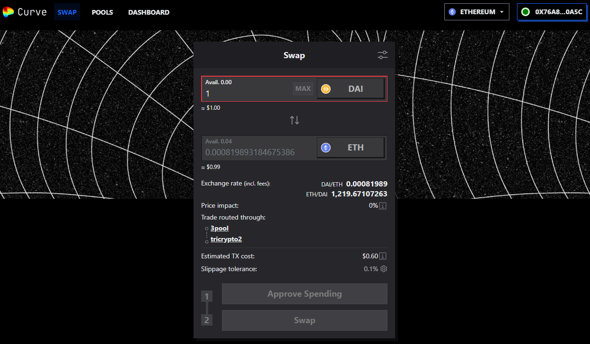
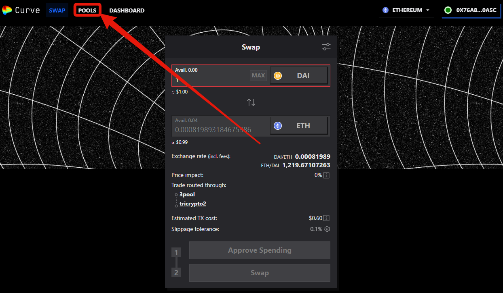
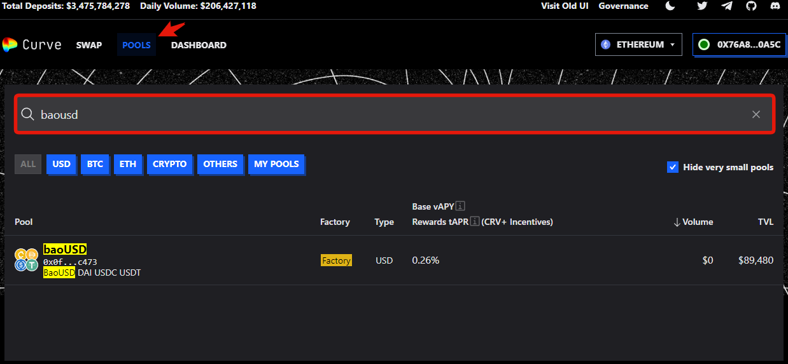
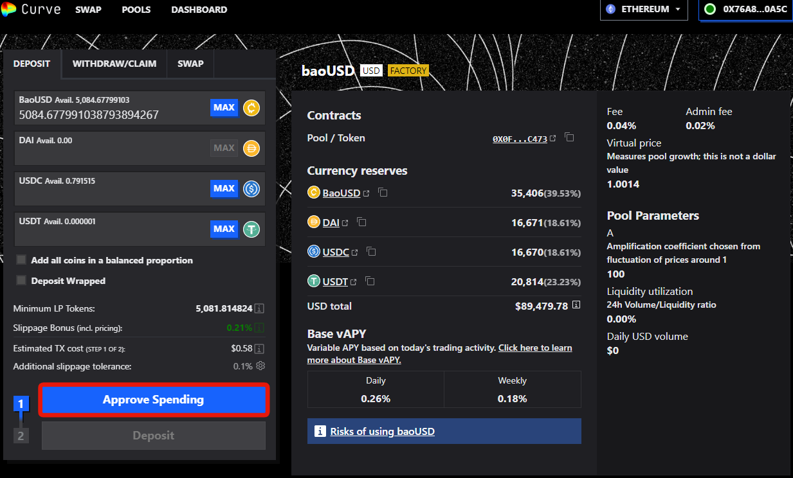
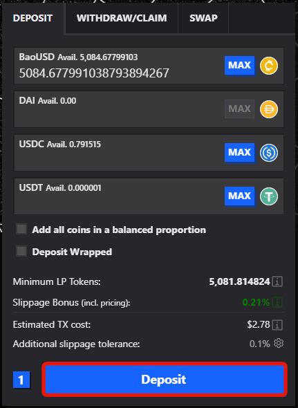

# Curve LPs

This will be going over the process from the homepage of [https://curve.fi/](https://curve.fi/) to creating the LP and, in this example, creating a baoUSD-3crv LP, but the same will be for any other LP. After entering the website, it should look like this.

<figure><figcaption></figcaption></figure>

Next, click on the pools tab in the top left.

<figure><figcaption></figcaption></figure>

Once there, go to the search bar, type in the desired pool you wish to deposit tokens into, and form an LP. Again, for this example, I am doing baoUSD-3crv, so I will enter that.

<figure><figcaption></figcaption></figure>

Click on the pool that is the result of your search and matches the one you wish to deposit to, then enter the amount of each token you want to deposit. In my case, I will deposit baoUSD that I minted from the [market](https://info.bao.finance/docs/guides/bao-markets). Once you enter the amount you wish to deposit, click "approve", then "confirm" in your wallet.

<figure><figcaption></figcaption></figure>

After you approve it, click "Deposit" and "confirm" in your wallet.

<figure><figcaption></figcaption></figure>

You now have your LP token! The following section will go over Uniswap LP tokens. You may skip it if it does not relevance to you.
