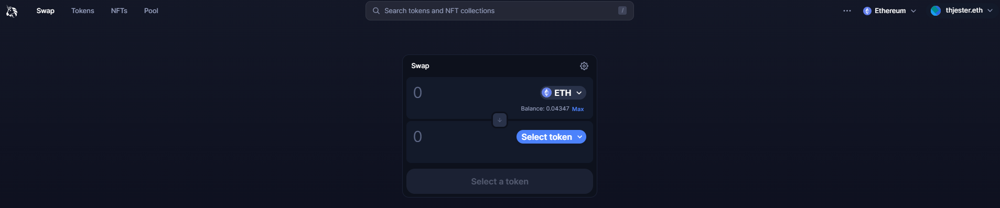
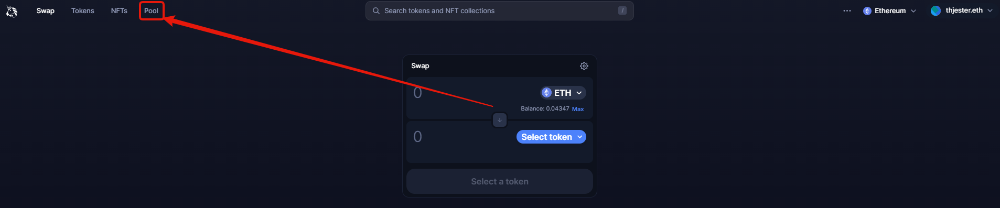
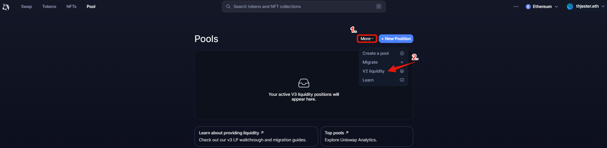
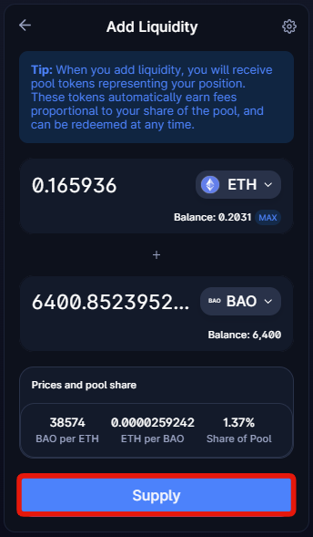

# Uniswap LPs

This will be going over the process of getting Uniswap LP tokens from the homepage of the app site at [https://app.uniswap.org/](https://app.uniswap.org/) to deposit into BAO Gauges. In this example, BAO-ETH but it will be the same process for other pools as well. After entering the app site, it should look like this.

<figure><figcaption></figcaption></figure>

We will need to go to the pool tab by clicking it on the right side of the top left tabs.

<figure><figcaption></figcaption></figure>

After you do so, it'll bring you to a page that looks like this. Click on the "More" tab, then on V2 liquidity tab. Before this, ensure you get equal amounts of both BAOv2 and ETH.

<figure><figcaption></figcaption></figure>

After you do so, you will see this on the page. Click "Add v2 liquidity"

<figure><figcaption></figcaption></figure>

Once you do, select the two tokens you wish to pair. In my case, it'll be BAO-ETH (If you wish to do BAO-ETH, ensure that it is BAOv2 and not the original BAO token to enter the gauge.) After you enter the tokens you want and the amount, click "supply," "confirm supply," and then "confirm" in your wallet.

<figure><figcaption></figcaption></figure>

Once these transactions are complete, you will have your LP tokens!
