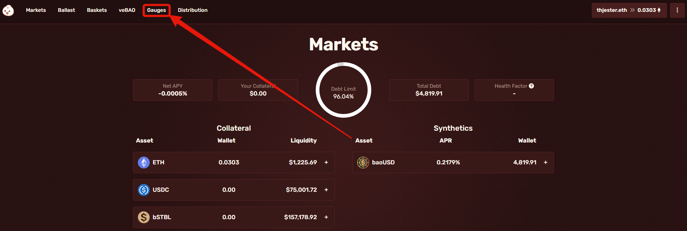
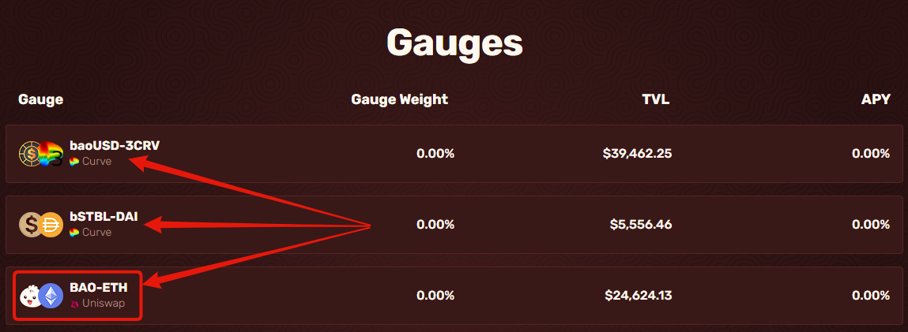
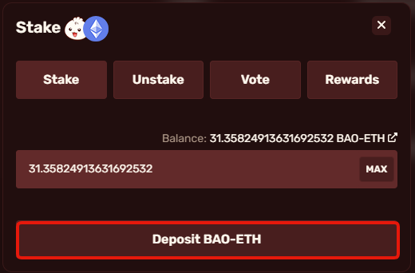
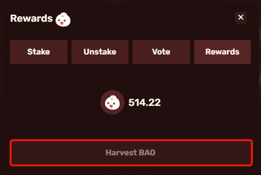

# Depositing LPs for rewards

Once you have your LP tokens, you will need to go to the app site at [https://app.bao.finance/](https://app.bao.finance/) to deposit them, this process will be the same whether for Curve or Uniswap LPs. When you are there, you will need to click on the [Gauges](https://app.bao.finance/gauges/) page.

<figure><figcaption></figcaption></figure>

When you are in the Gauges page, it will have the gauges where you can deposit your LP tokens. Choose whichever best suits you and you have the LP tokens for. In my case, I will be going for BAO-ETH so I click on the BAO-ETH tab.

<figure><figcaption></figcaption></figure>

In the UI that pops up, click stake if you aren't already on that tab then, enter the amount you wish to deposit into the Gauge, then click "Deposit \[LP name]" and then confirm in your wallet.

<figure><figcaption></figcaption></figure>

You will now receive BAO emissions! To collect your rewards go to the rewards tab and click "Harvest BAO" then click confirm in your wallet.

<figure><figcaption></figcaption></figure>
