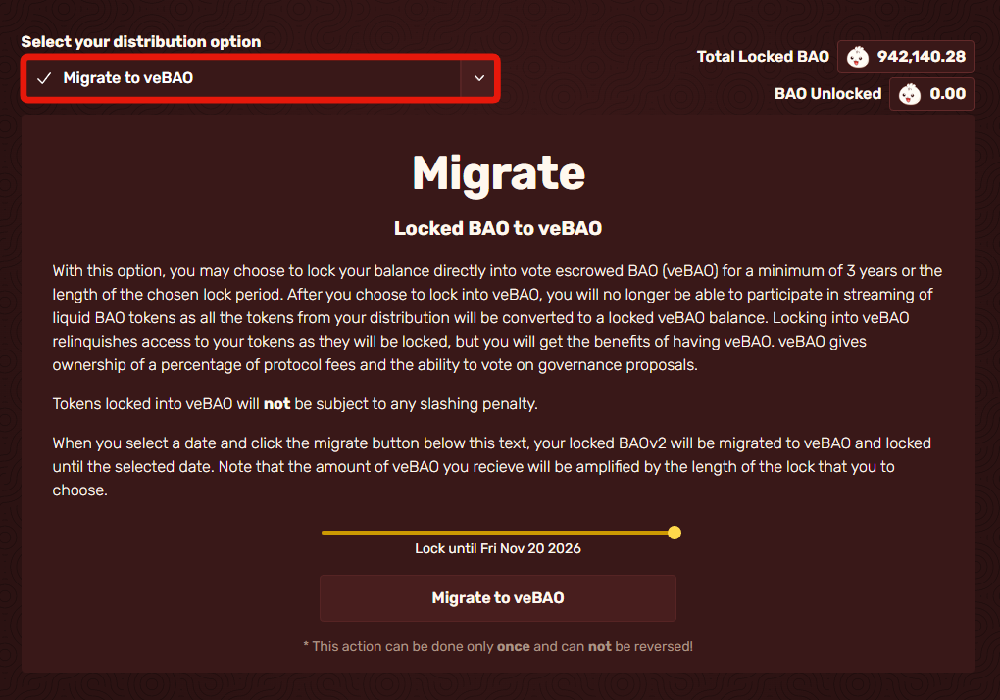
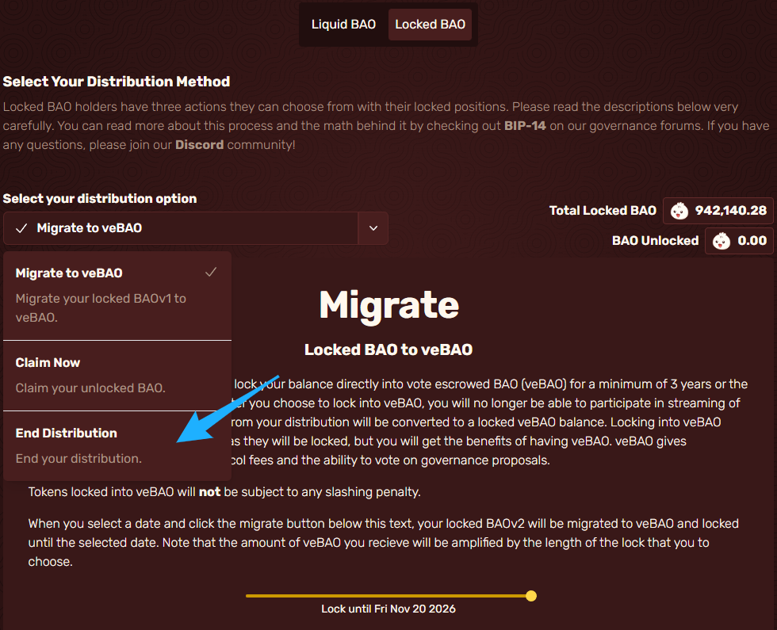
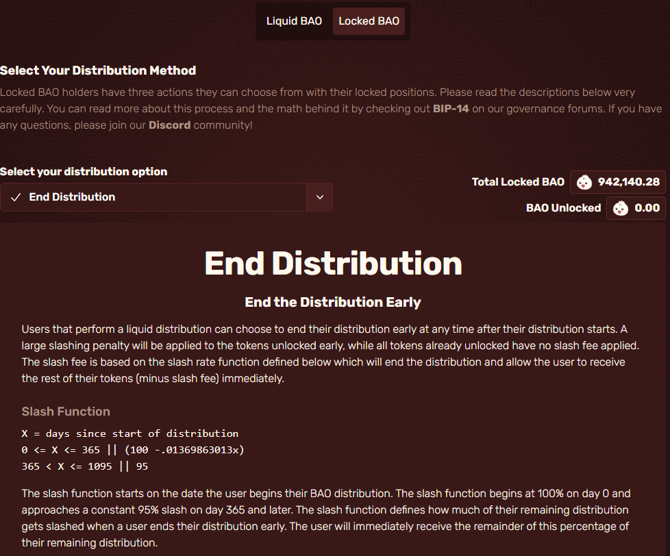
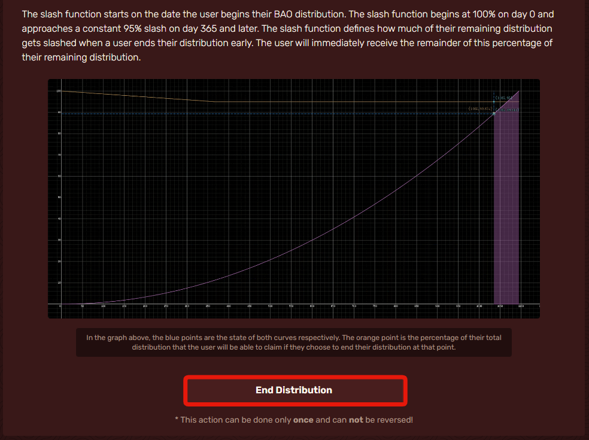

# End your Distribution

Make sure to read this page thoroughly and calculate your Slash fee and Lock reward loss before committing to ending your distribution. You must go to the tab under "Select your distribution option," Indicated by the red box.

<figure><figcaption></figcaption></figure>

After you open that tab, hit "End Distribution," and it will bring you to a new page.

<figure><figcaption></figcaption></figure>

It should bring you to a page that looks like this, make sure you read the page and understand the risks before committing to ending your distribution.

<figure><figcaption></figcaption></figure>

Scroll down until you see a button that says "End Distribution." There, when you are ready to and know the risk and how many rewards you may lose doing so you will click it and then hit confirm in your wallet.

<figure><figcaption>
This is unreversible! Do not click this unless you know what you are doing you may lose all your rewards!
</figcaption></figure>
