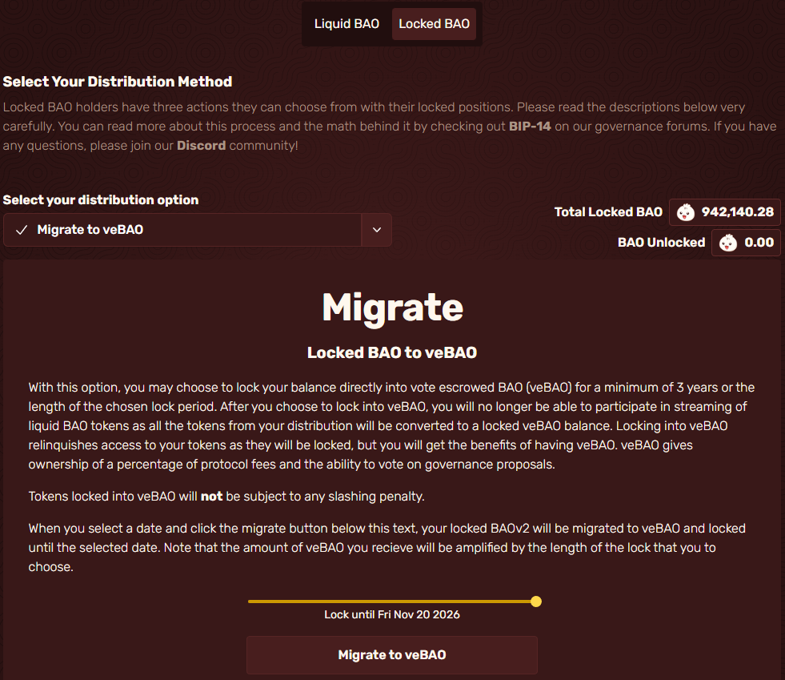
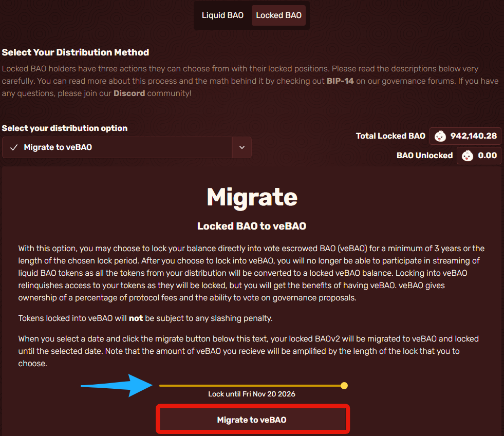

# Relocking into veBAO

When you first start up your distribution, it should look like this.

<figure><figcaption></figcaption></figure>

There will be a slider that you can change for any date between 3-4 years from now indicated by the blue arrow then once you decided how long you wish to relock for veBAO click on "Migrate to veBAO" and then click confirm in your wallet.

<figure><figcaption>
Once you do this it is not able to be undone.
</figcaption></figure>

&#x20;                                   You have now migrated your locked balance into veBAO!
