# Bridging assets to Polygon

## ETH (Main net) <--> MATIC


Moving funds from the main net to Matic can take several minutes while the transaction is being processed.


1\) Head over to the [Matic Bridge](https://wallet.matic.network/bridge/) and connect your wallet\
2\) In the right section of the page, click on the token selector to change the asset you want to bridge

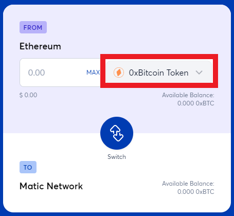

3\) You can search or scroll to select the asset you want to bridge. Once you find the token in the list, simply click on it.

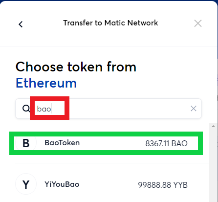

4\) Input the amount you want to bridge and click the transfer button

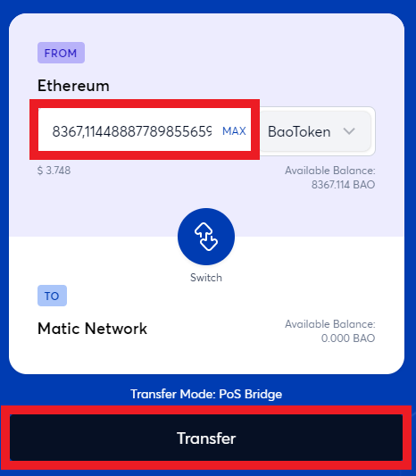

5\) Continue through the different windows. Be sure to read all warnings and information given.&#x20;

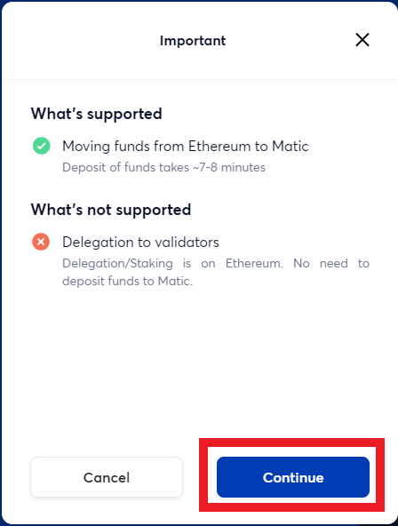

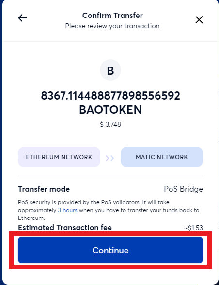

6\) Confirm the transaction in your Metamask wallet\
7\) The transaction should now be in process

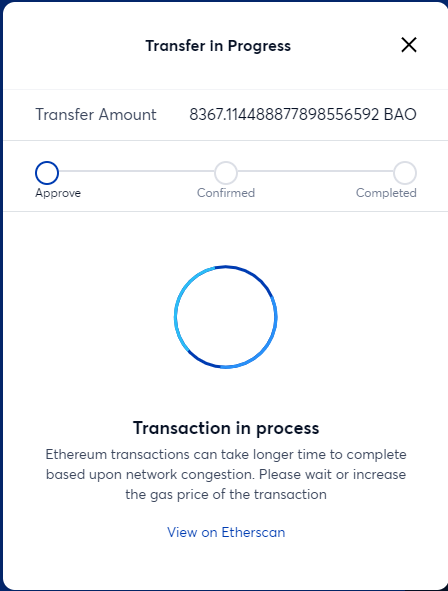

8\) Confirm the transaction after a few minutes by pressing the "Continue" button and confirming it in your Metamask wallet

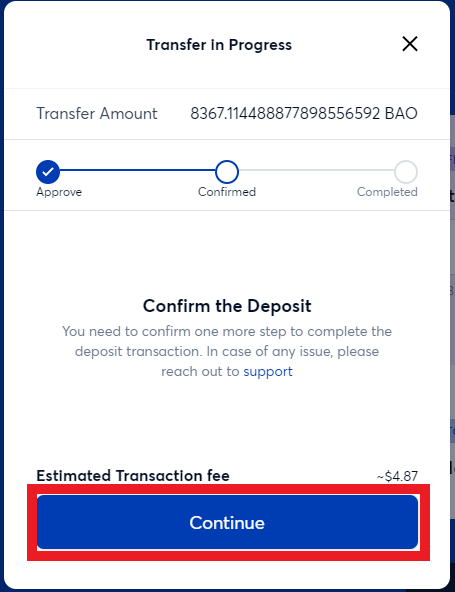

9\) Transaction has been completed ! You simply need to wait a few minutes to see your balance on Matic being updated.

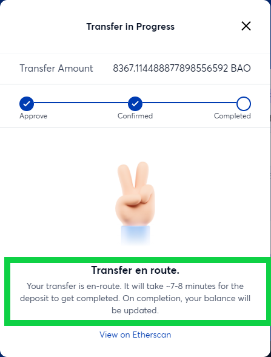

## xDai or BSC <--> MATIC


xPollinate only works if there is enough liquidity sitting in the other end (Matic in this example)


1\) Head over to [xPollinate.io](https://www.xpollinate.io/) and connect your wallet\
2\) Make sure the asset you want to bridge has enough liquidity on Matic

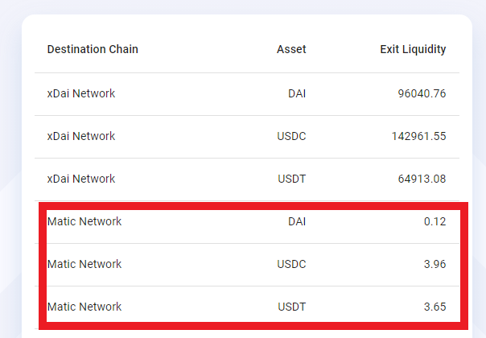

3\) Select the chain where you have assets (xDai or BSC)\
4\) Select the asset you want to bridge (DAI, USDC, USDT)

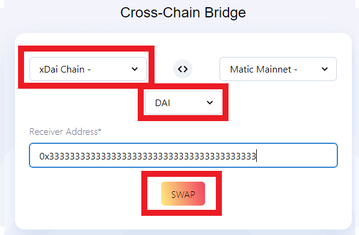

5\) Press the SWAP button\
6\) Sign the signature request coming from your Metamask wallet\
7\) Input the amount you want to bridge and press Swap

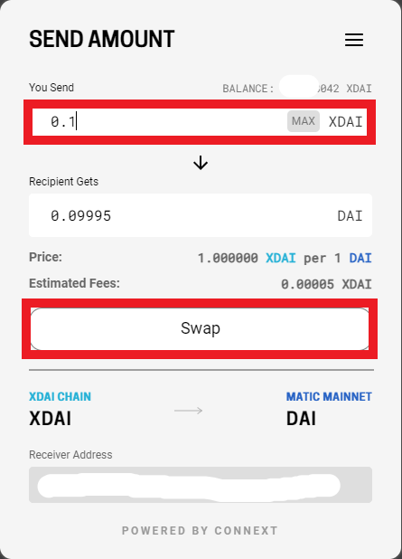

8\) Confirm the transaction in your Metamask wallet\
9\) Wait a couple of minutes \
10\) Transaction has been completed !

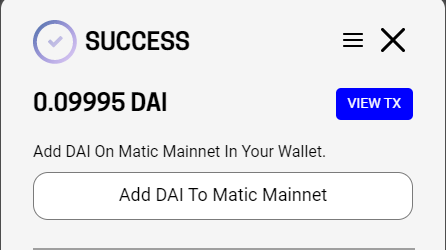
