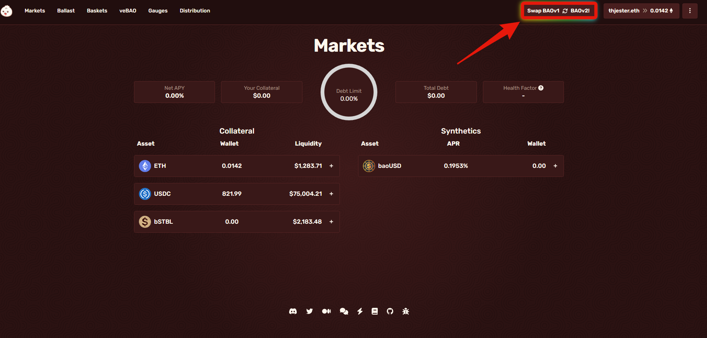
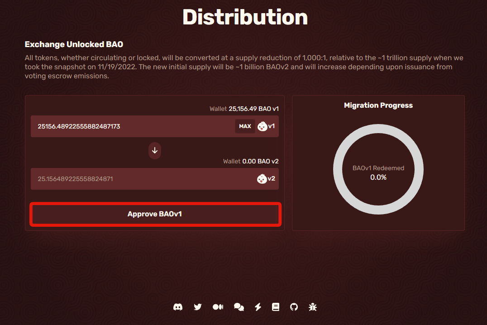

# Exchanging BAOv1 for BAOv2

Go to [app.bao.finance](https://app.bao.finance/) when you are on the site, you'll want to go to the top right and click "Swap BAOv1 - BAOv2!"

<figure><figcaption></figcaption></figure>

Once you clicked that, it'll have taken you to the exchange[ page](https://app.bao.finance/migrate/), which looks like this.&#x20;

<figure><figcaption></figcaption></figure>

Next, you'll need to approve the use of BAOv1, so click on "Approve BAOv1", then click confirm in your wallet.

<figure><figcaption></figcaption></figure>

You will need to specify the amount of BAOv1 you wish to exchange or click MAX, then click "Swap BAOv1 for BAOv2" then click confirm in your wallet.

<figure><figcaption></figcaption></figure>

&#x20;                                       You now have redeemed your BAOv1 for BAOv2!
