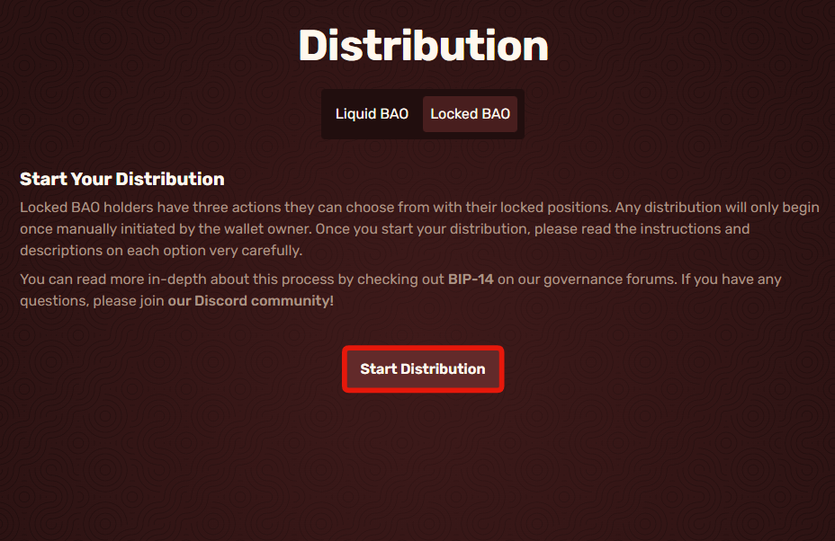

# Migrating Locked BAO

First, you will need to be on the [distribution page](https://app.bao.finance/distribution/), then go to Locked BAO it should look like this.

<figure><figcaption></figcaption></figure>

Click on "Start Distribution," then click confirm in your wallet.

<figure><figcaption></figcaption></figure>

Make sure if you wish to stake your Locked Balance to veBAO to do it first because if you lock the liquid token first, you will not be able to do so with your locked anymore.
