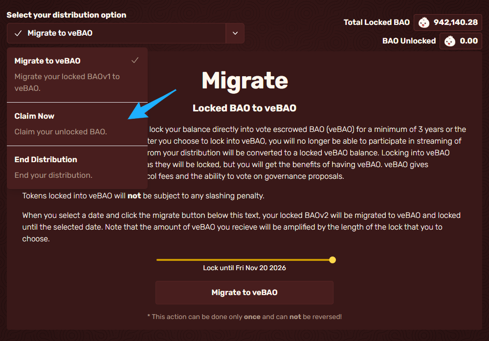
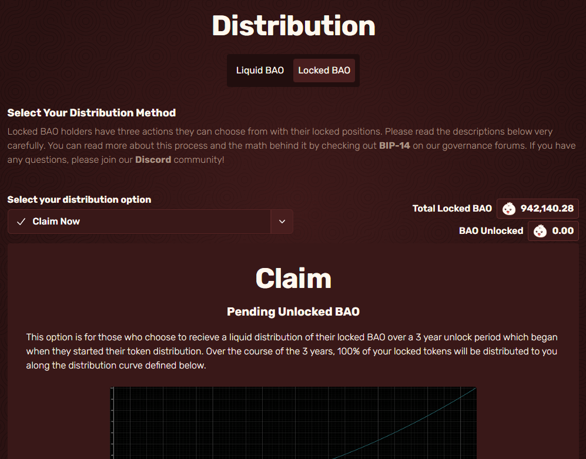
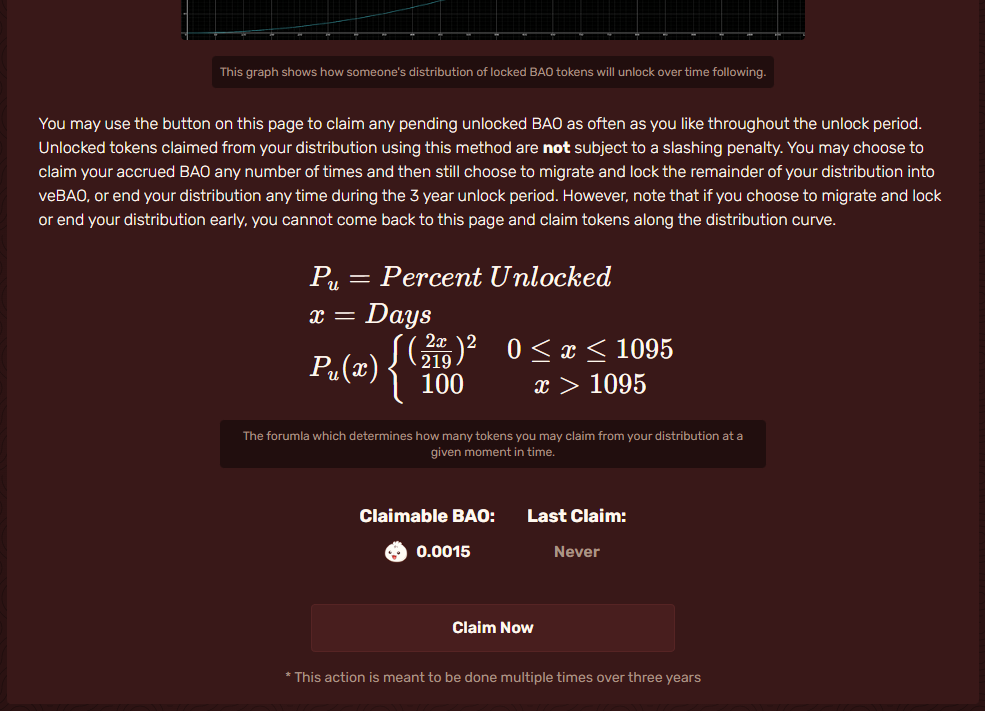
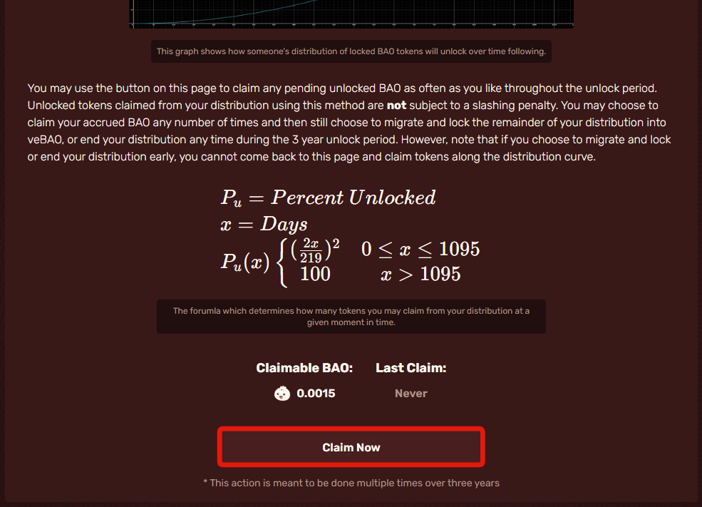

# Claiming Locked BAO

Click on the tab under "Select your distribution option" indicated by the red box.

<figure><figcaption></figcaption></figure>

Then go to "Claim now" indicated by the blue arrow and click on it.

<figure><figcaption></figcaption></figure>

This will bring you to the page where you can claim your BAOv2 that has begun to unlock non-linearly over three years after you started your distribution.

<figure><figcaption></figcaption></figure>

Scroll down until you see a button labeled "Claim now". This area will show you how much you currently have unlocked and can claim. You may do it as many times as you wish, but keep gas fees in mind.

<figure><figcaption></figcaption></figure>

When you are ready, click "Claim now," indicated by the red box. Then hit confirm in your wallet.

<figure><figcaption></figcaption></figure>

&#x20;                                        You now know how to claim your unlocked rewards.
