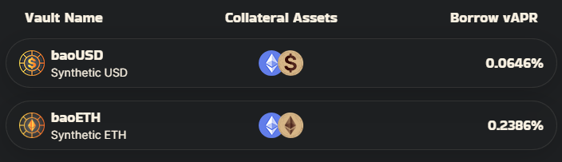
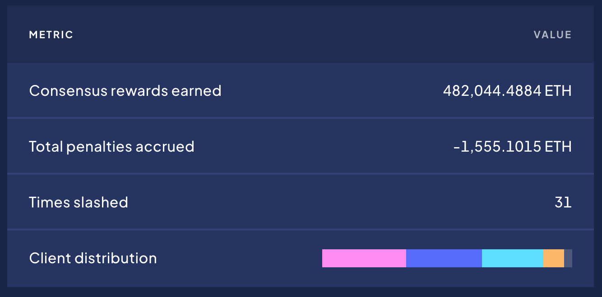

---
layout:
  title:
    visible: true
  description:
    visible: false
  tableOfContents:
    visible: true
  outline:
    visible: true
  pagination:
    visible: true
---

# Borrow Vaults

Borrow Vaults allow users to easily borrow synthetic tokens, backing them with the deposited collateral in the process. Loans can be repaid at any time along with the stability fee (interest) before collateral can be withdrawn.\
\
USD and ETH based collaterals can be added or removed by the Bao community. The primary factors under consideration are decentralization and liquidity, but full risk assessments are taken for every collateral for the community to evaluate before voting.&#x20;

### Collateral Options

* ETH
* wstETH
* Other LSTs (coming soon)
* LUSD

### **Vaults**

Each vault accepts any of the collateral types and allows you to borrow a one of the synthetics below&#x20;

* baoUSD: USD pegged stablecoin
* baoETH: ETH pegged stablecoin
* Other stablecoins and data based synthetics (coming soon!)

### **Interest Rates**

When you mint synthetic tokens, you incur interest. The Annual Percentage Rate (APR) represents the yearly rate at which this interest will accumulate. Please note that these rates are variable, adjusting according to the prevailing market conditions.

<figure><figcaption>
Borrow vAPR shows the interest rates
</figcaption></figure>

### **Liquidations**

For all collaterals, a liquidation fee of 10% applies. Here's the breakdown:

* 2.8% is channeled to the insurance fund.
* 7.2% is rewarded to the liquidator.

If the Debt Health of your collateral dips below 1, it's earmarked for liquidation. In such an event, any user can settle your loan. Upon doing so, they're permitted to claim collateral worth 110% of the repayment value.

<figure><figcaption>
To avoid liquidation, keep your debt health > 1
</figcaption></figure>

You can improve your debt health by depositing more collateral or paying off some debt.

### Key Use Cases

* Leverage Yield: By using yield bearing collateral to borrow a pegged asset you can leverage the yield earned with minimal liquidation risk. For example, using wstETH collateral to borrow baoETH will create a position where collateral goes up in value vs debt and selling the borrowed baoETH for more wstETH will allow you to leverage the yield on wstETH.&#x20;
* Leverage price: By borrowing a synth not linked to the price of your collateral, and selling it for more collateral creates a leveraged long position on the collateral vs the debt token (or leveraged short on the debt token vs collateral)
* Yield Farming: Keep exposure to your LST tokens while yield farming with dollars by using wstETH or other LST collateral to borrow baoUSD and deposit into an incentivised liquidity or stability pool to earn more rewards. Check out our&#x20;
