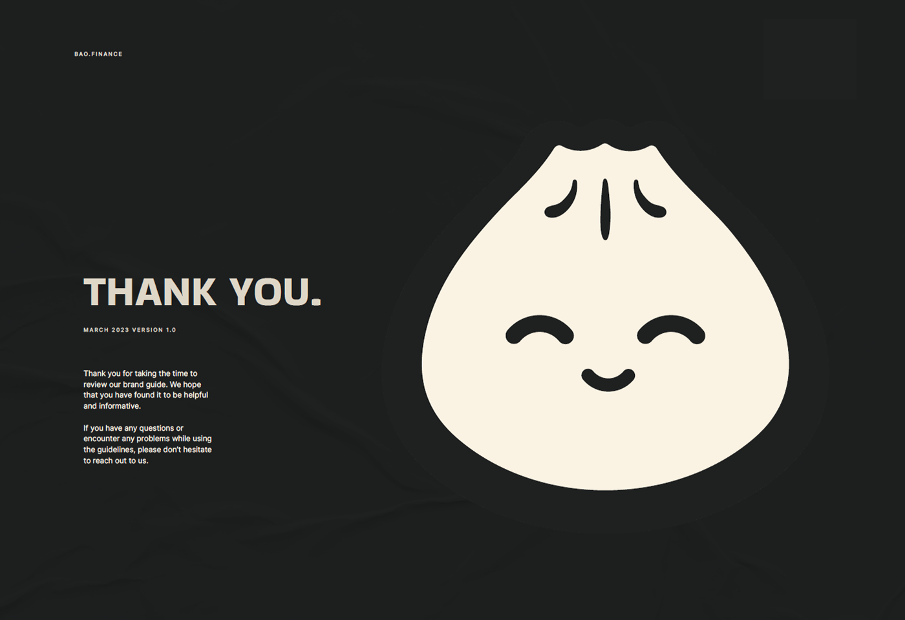
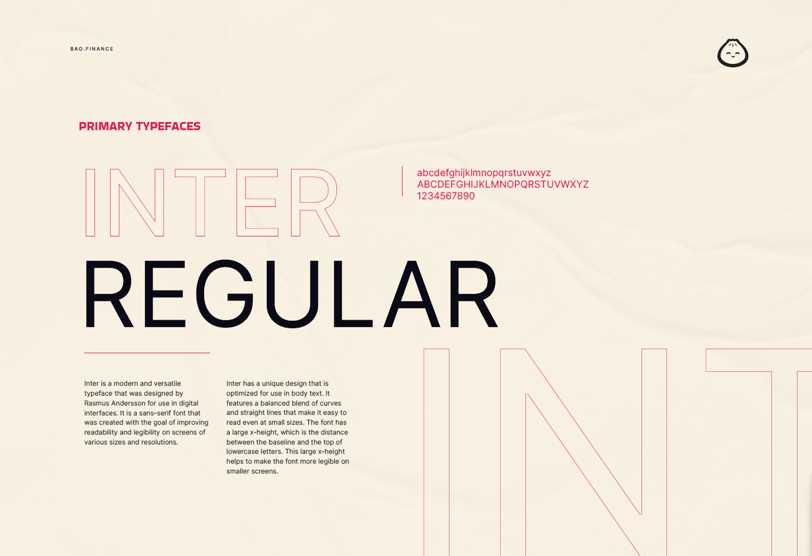
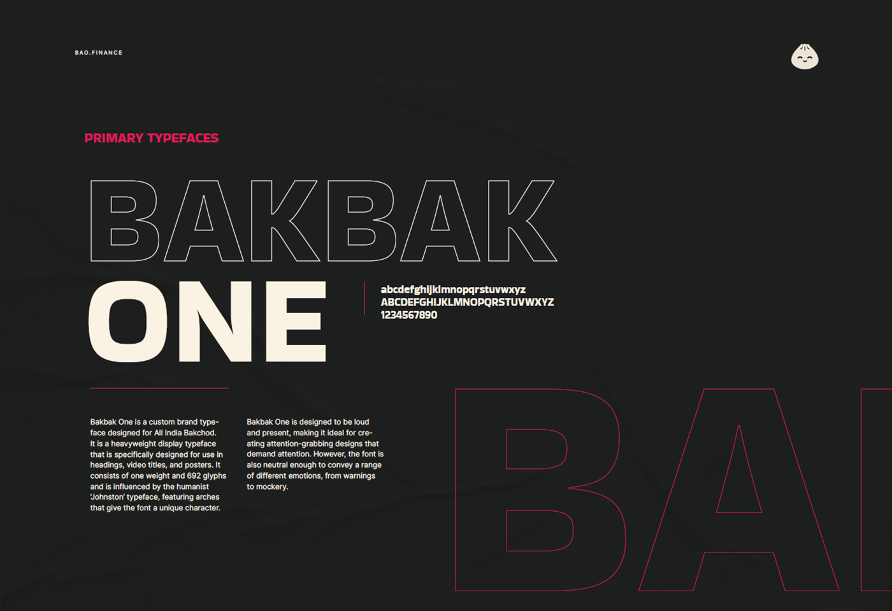
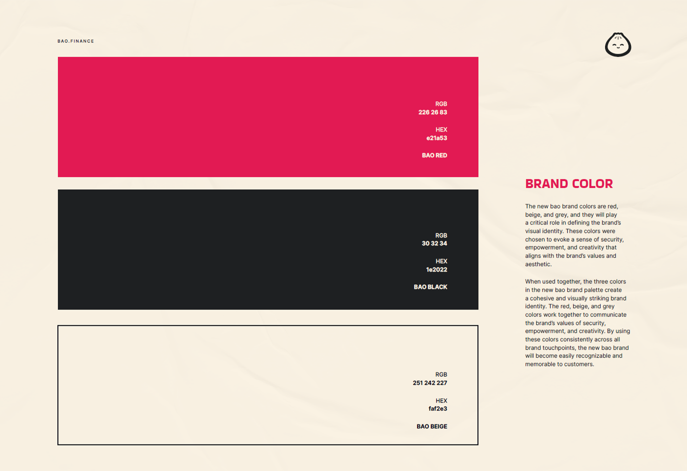
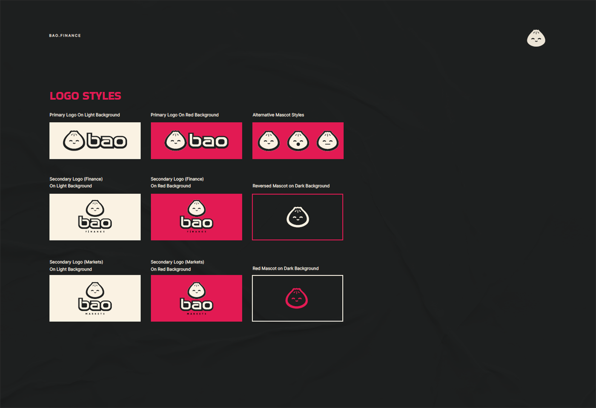
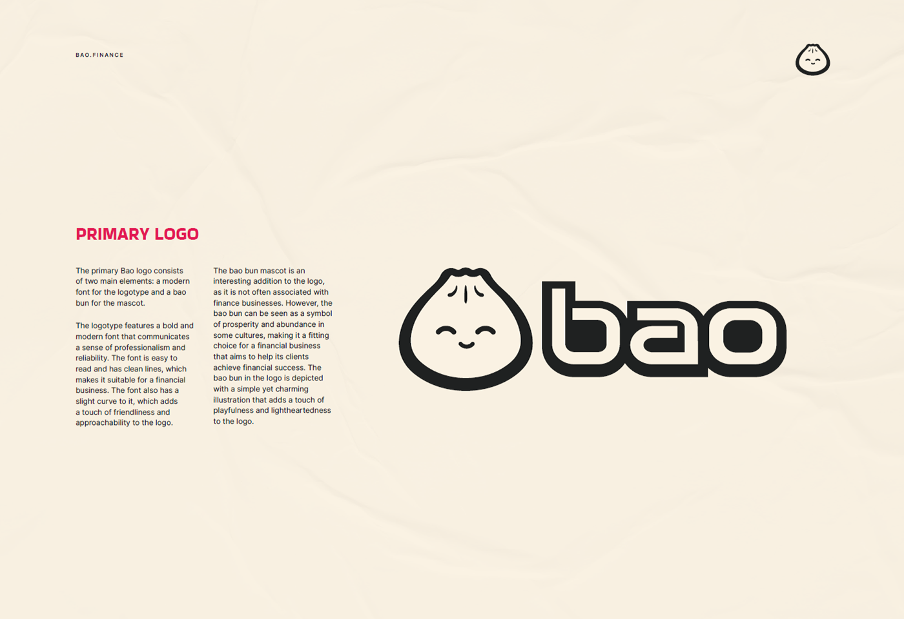

---
layout:
  title:
    visible: true
  description:
    visible: false
  tableOfContents:
    visible: false
  outline:
    visible: false
  pagination:
    visible: true
---

# Brand Guidelines

## Logo

.svg>).svg>).svg>).svg>).svg>)

## Logo Text Only

.svg>) (1).svg>).svg>)

## Brand Guidelines

