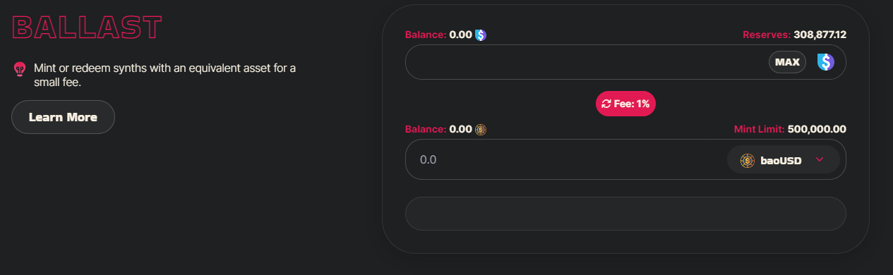
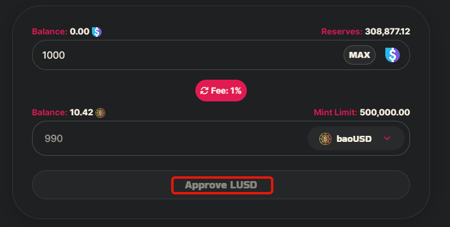

# Ballast

The Ballast allows users to swap between synthetics and available LUSD/ETH for a 1% fee.

* Ensure you are on the [Swap ](https://app.baofinance.io/ballast)page.

* Enter the amount you want to swap/mint then click approve at the bottom to allow the contract to use your token, this will bring up a transaction in your wallet when it does click confirm.

* After you approve, click on the swap button at the bottom. This will push a transaction to your wallet, click confirm.
