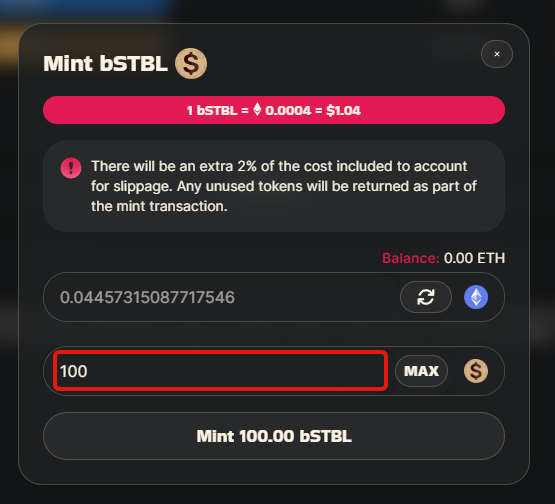

# Minting a Basket

* Make sure you are on [https://app.baofinance.io/baskets](https://app.baofinance.io/baskets) and your wallet is connected.
* Select the basket you wish to mint.

<figure><figcaption></figcaption></figure>

* Check the "premium" to see if you could get bSTBL tokens easier on an exchange. A negative premium means swapping uses less tokens, but be aware of the liquidity available, and the impact your swap will make on your rate.

<figure><figcaption></figcaption></figure>

* If you decide to mint, click the **mint** button

<figure><figcaption></figcaption></figure>

* Select the token you wish to use to mint the basket by clicking the token logo to switch between the options\

<figure><figcaption></figcaption></figure>

* Enter the amount of basket tokens you would like to mint (or click the **max** button for the maximum amount). The amount of tokens that will be used is automatically updated. Remember, you are likely to have some returned to your wallet because of the markup to avoid failed transactions.\

<figure><figcaption></figcaption></figure>

* Once you are happy with the amount, approve the token for minting to be used by the app and confirm the transaction in your wallet.\

* Once the transaction is processed you will be able to mint, by clicking the **mint** button that replaces the approve one, then approving the transaction in your wallet.

<figure><figcaption></figcaption></figure>
