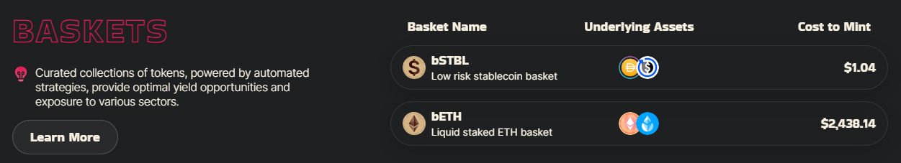
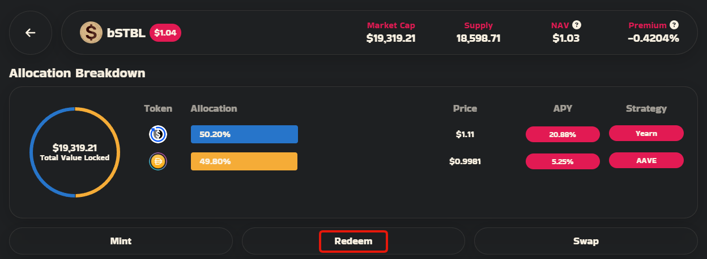
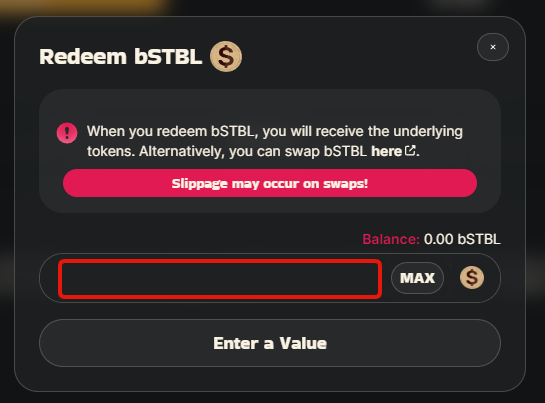
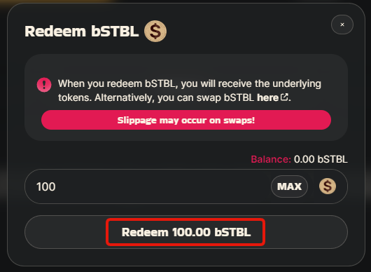

# Redeeming a Basket


Before you redeem a basket, check the premium to see if you can receive more tokens swapping.


* Make sure you are on [https://app.baofinance.io/baskets](https://app.baofinance.io/baskets) and your wallet is connected.
* Select the basket you wish to redeem.

<figure><figcaption></figcaption></figure>

* Check the "premium" to see if it is better for you to use an exchange or to redeem. A positive premium means swapping may return more tokens, but be aware of the liquidity available, and the impact your swap will make on your rate.\

* If you decide to redeem, click the **redeem** button

<figure><figcaption></figcaption></figure>

* Enter the amount of basket tokens you would like to redeem (or click the **max** button for the maximum amount).

<figure><figcaption></figcaption></figure>

* Once you are happy with the amount, click the redeem button and approve the transaction in your wallet.

<figure><figcaption></figcaption></figure>

* The basket tokens will be burned and the underlying tokens are withdrawn from the vault, sold and returned as your chosen redemption token.
