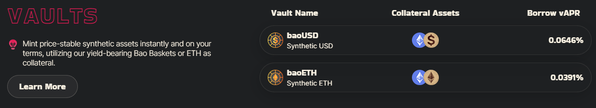
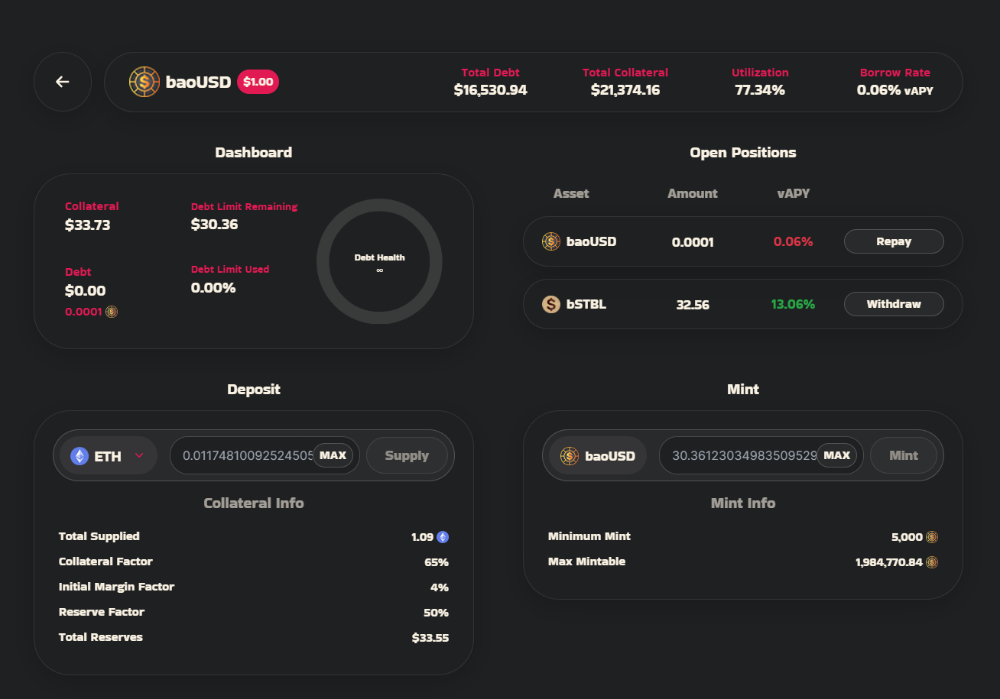
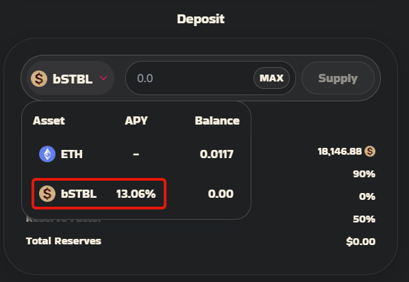
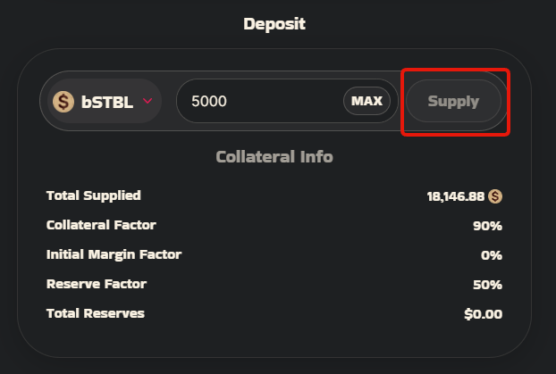

# Deposting

* First, go to [https://app.baofinance.io/vaults](https://app.baofinance.io/vaults) this page will present you with the different synthetic options.

<figure><figcaption></figcaption></figure>

* Select any of the Synths for this example I'll be doing baoUSD

<figure><figcaption></figcaption></figure>

* When you click it should present you with the statistics for the Vault and you, for our purpose of minting a new synthetic we will be selecting one of the collaterals.

<figure><figcaption></figcaption></figure>

* When you click it, it should present you with the collateral info for your collateral, after this, we will want to click Supply.

<figure><figcaption></figcaption></figure>

* Enter the amount you wish to supply, then click supply in the tab. You’ll notice as you type in the amount to supply, your new debt limit is updated. After you decide your amounts, click supply then confirm in your wallet.
